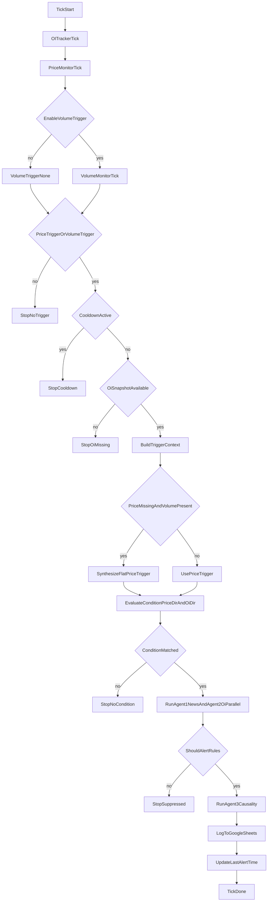

```mermaid
flowchart TD
    start[TickStart] --> oiTick[OITrackerTick]
    oiTick --> priceTick[PriceMonitorTick]
    priceTick --> volumeEnabled{EnableVolumeTrigger}
    volumeEnabled -->|yes| volumeTick[VolumeMonitorTick]
    volumeEnabled -->|no| noVolume[VolumeTriggerNone]
    noVolume --> triggerGate
    volumeTick --> triggerGate

    triggerGate{PriceTriggerOrVolumeTrigger} -->|no| stopNoTrigger[StopNoTrigger]
    triggerGate -->|yes| cooldownCheck{CooldownActive}

    cooldownCheck -->|yes| stopCooldown[StopCooldown]
    cooldownCheck -->|no| oiAvailable{OiSnapshotAvailable}

    oiAvailable -->|no| stopOiMissing[StopOiMissing]
    oiAvailable -->|yes| buildTriggerContext[BuildTriggerContext]

    buildTriggerContext --> volumeOnlyCase{PriceMissingAndVolumePresent}
    volumeOnlyCase -->|yes| synthPrice[SynthesizeFlatPriceTrigger]
    volumeOnlyCase -->|no| keepPrice[UsePriceTrigger]
    synthPrice --> evaluate
    keepPrice --> evaluate

    evaluate[EvaluateConditionPriceDirAndOiDir] --> hasCondition{ConditionMatched}
    hasCondition -->|no| stopNoCondition[StopNoCondition]
    hasCondition -->|yes| runA1A2[RunAgent1NewsAndAgent2OiParallel]

    runA1A2 --> shouldAlert{ShouldAlertRules}
    shouldAlert -->|no| stopSuppressed[StopSuppressed]
    shouldAlert -->|yes| runA3[RunAgent3Causality]

    runA3 --> logSheet[LogToGoogleSheets]
    logSheet --> setCooldown[UpdateLastAlertTime]
    setCooldown --> done[TickDone]
```
